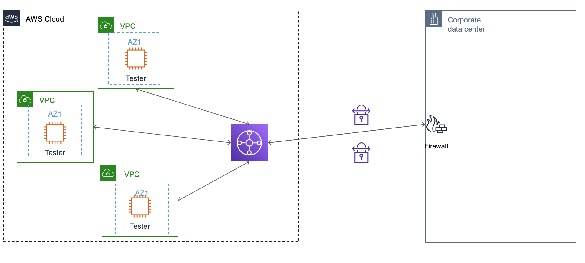

# Goal
Demo tgw's ability to connect VPN and VPCs.

Done in an automatic fashion, note route table need to modified with sepereate resource.

# Step

1. create 3 VPCs, and test instance with them.

2. create on-prem env simulated in aws, using self made module. (WIP)

3. create tgw, create attachment to 3 VPCs and On-prem.

4. within on-prem module, ansible configs centos's strongswan ipsec vpn and frrouting bgp router.

# Result

1. on-prem is able to ping tester instance within 3 VPCs
2. tester instances with 3 VPCs can ping each other.
